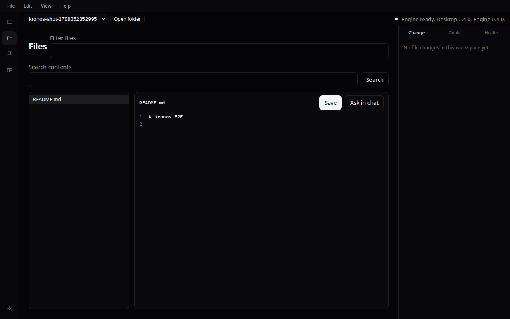
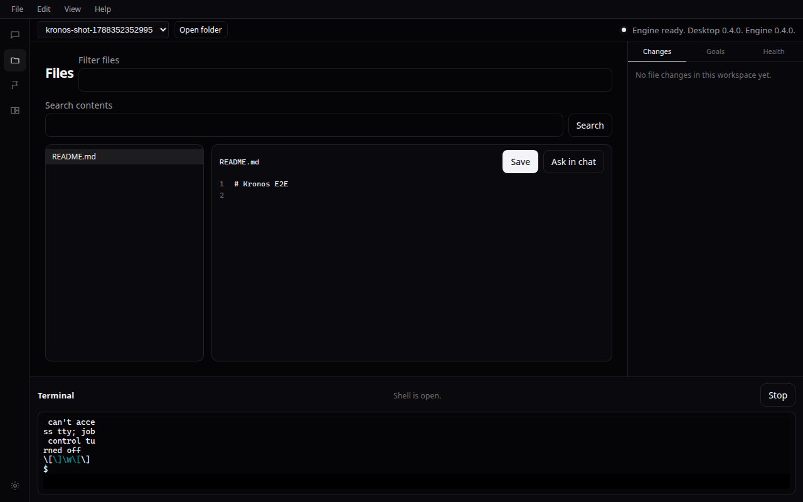
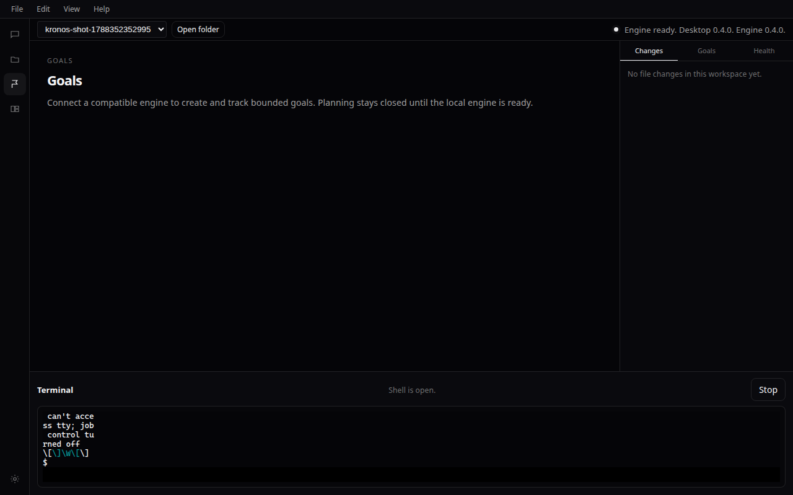
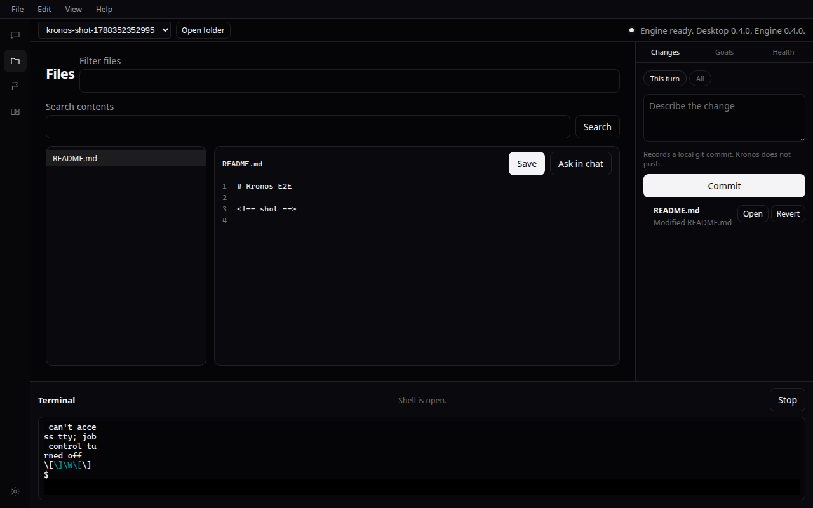

# Agent desktop

Kronos is a locally installed desktop app (Tauri WebView, also previewable in a browser). It is not an operating system. This note describes **0.4.0** (workbench). A bundled engine, embeddings installer, and in-app updater arrive in 0.5.0.

## Shell

- Application menu: File, Edit, View, Help. File holds New chat, Open workspace, Go to file, Models, and Settings. Go to file opens the Go to file palette in the Files activity. Edit is Cut, Copy, Paste, Select all, Find, Replace, and Go to line (those last three target the Files editor).
- Collapsible icon activity bar on the left: Chat, Files, Goals, Workspaces, Settings. View can also hide the Changes inspector and open the Terminal panel.
- Chat is the main stage. Conversation history is a View toggle, not a permanent column.
- Workspace switcher lives in the title bar.
- A right drawer holds Changes, Goals/Runs, and Health as tabs. Changes is the default tab. Revert and local commit are available when a workspace is open. Goals stay visible without forcing a goal form on every chat.
- Files is a real editor: tree, tabs, save through the workspace files API, Find/Replace/Go to line, Ask in chat on a selection, and a Go to file palette.
- Terminal (View menu) runs a real PTY in the enrolled workspace folder.

## First run

1. If the local engine is not connected, show that fact. Do not open the old 12-page dashboard. The gate heading is "The local engine is not running".
2. If the engine is ready and no **orchestrator** is assigned, block on Connect a model. API keys go to the OS secret store through the existing provider API.
3. A workspace folder is not required to pass the gate. Chat can explain Kronos. Opening a git folder starts indexing. The same UI can run in a browser preview while the local engine is running (`pnpm --filter @kronos/desktop dev`). The page talks through a same-origin `/kronos-engine` proxy, so it never holds the engine token. `vite preview` stays engine-unavailable.
4. Until 0.5.0 the engine on PATH must match the desktop version.

## Chat

Streaming conversation in the pane. Tokens appear as the model writes them. With a workspace open, the agent may search the local per-repository index, list/read/write files inside the enrolled realpath, run a capped command in that folder, search active memories, and create a bounded Goal for unattended work. Root AGENTS.md, .cursorrules, CLAUDE.md, and files under .cursor/rules are attached to the system prompt on every turn, capped in size. Nested copies of those names are ignored. Apply on a fenced code block writes that file through the same workspace write path. Paste a screenshot into the composer. Kronos stores the file locally and sends it to the connected model as an image. Most turns stay in the thread. Tool calls render as named cards with a text status (done, failed, running). The user message appears as soon as Send is pressed. Stop closes the in-flight model request. The composer shows an estimated token count for this thread, including a small allowance for the system prompt. The count is an estimate, not the model's billed usage. At 80 percent of the orchestrator context window it asks you to start a new chat. The local index refreshes from git commits and from uncommitted files in enrolled folders. Path buttons in assistant text open the Files editor on that path.

`/goal` creates a draft and reports readiness in plain sentences. Chat does not start the executor.

## Research applied

This is how we design in Cursor, not a Kronos product. Sources: Cursor Agents Window, VS Code Agents Window, and Programming by Chat (arXiv:2604.00436).

- Progressive specification: no Goal form on every message. Short follow-ups stay in the same thread.
- Persistent plan: Goals activity is the workbench for unattended work, matching developers who pin a plan when a chat gets long.
- Review on the right: Changes is the default inspector tab. It lists the live git working tree with Revert and local commit (not GitHub push). Open a changed file in the Files editor from the list.
- History is a View toggle, not a permanent column.

## Goals workbench

The Goals activity lists goals, shows planned steps, and exposes Plan and Tick. Autonomy mode is read-only in the UI. Readiness comes from `GET /repositories/{id}/goal-readiness`; failed checks link to Settings or Workspaces through `readinessFixHref` (workspace, models, GitHub connections). Runs for the selected goal appear in the inspector Goals tab.

## Health

The Health tab and Settings doctor share engine checks from `GET /ops/doctor` when available, with local fallbacks for engine, model, workspace, index, secrets, and embeddings. Each check has a label, ok flag, and a short sentence. Status is never color-only.

## Copy

Product text calls Kronos a desktop app. Signing warnings explain that Windows and macOS warn on unsigned installers, in plain language.
