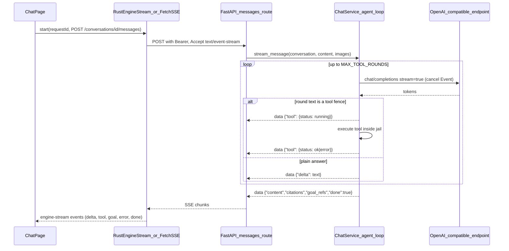

# Kronos 0.2 → 0.5 Mega Plan: Agent Desktop

> Execution notes (2026-09-02): do **not** merge [PR #14](https://github.com/shn3g/kronos/pull/14) (`reference-do-not-merge`). Copy files from it. This branch already includes [PR #15](https://github.com/shn3g/kronos/pull/15). CI now runs on **ready-for-review** pull requests only; merging to `main` does not re-test; `v*` tags run Release. Tag `v0.3.0` / `v0.4.0` / `v0.5.0` after each version commit is on `main`. Each subphase is implemented by a fresh agent and reviewed by a different agent.

> For the implementing agent: this plan assumes zero prior context. Work task by task, TDD (failing test first), commit per task, one PR per phase. Copy code from the reference by file, never `git merge` it (histories diverged before 0.2.0).

## 0. Ground truth

- Repo `shn3g/kronos`, base `main` = 0.2.0 (tag `v0.2.0`). Desktop: Tauri 2 + Vite + React 19 + TS (vitest, Playwright). Engine: Python 3.11+ FastAPI + SQLite, started by Rust as `python -m kronos_engine` from PATH. Bearer token lives in Rust (`install.json`), never in the WebView.
- Reference line (read-only, do NOT merge): [PR #14](https://github.com/shn3g/kronos/pull/14), branch `origin/reference-do-not-merge`. Read files with `git show origin/reference-do-not-merge:<path>` or `git worktree add /tmp/ref origin/reference-do-not-merge`. Below, `ref:<path>` means that branch. Its design doc is `ref:docs/architecture/agent-desktop.md`.
- [PR #15](https://github.com/shn3g/kronos/pull/15) (`cursor/engine-older-than-desktop-27fa`): engine-older-than-desktop is now incompatible; banner shows both versions. Merge it first; branch Phase 1 from it (or rebase once merged).
- Two chat stacks exist. main: `conversations` per repository, orchestrator prompt, packed index context (`CONTEXT_BUDGET_TOKENS = 2000`, `ANSWER_TOKEN_CAP = 1024`), `/goal` creates a draft goal, SSE via Rust `engine_stream` → `engine-stream` events. Reference: `chat_sessions`, tool-fence agent loop (6 rounds), `read_file/write_file/run_command/search_index/search_memory/create_goal/list_goals`, long POST + 250 ms polling, Files/Terminal/Changes, browser preview via Vite proxy.
- Decision: keep main's storage and SSE transport; port the reference's agent loop, tools, workspace modules, and shell UI onto it.
- In the VM where this plan was written, Task 1.1 exists uncommitted on branch `cursor/agent-desktop-shell-27fa` (files listed in 1.1). If you start elsewhere, redo 1.1 (small).

## 1. Product at 0.5.0 (treated internally as 1.0)

- Cursor/VS Code-like window: menu bar (File, Edit, View, Help), 48 px activity bar (Chat, Files, Goals, Workspaces, Settings), title row (workspace switcher, model switcher, engine status), Chat as the main stage, right inspector (Changes default, Goals, Health), bottom Terminal. No Home page.
- Chat is a real agent: streams tokens, reads/lists/writes files inside the enrolled folder, runs capped commands, searches the local hybrid index and active memories, applies fenced code, accepts pasted screenshots and `@file` mentions, honours AGENTS.md/.cursorrules/CLAUDE.md/.cursor/rules. Context budgets come from the model's window, not a 2k pack.
- `/goal` hands work to the deterministic system and reports readiness (models assigned, mode/freeze, GitHub controller, reviewer app, branch protection, workflow, CODEOWNERS, budgets) in plain sentences, creating a draft goal either way.
- Any OpenAI-compatible URL works (presets incl. OpenCode Zen, OpenRouter, Ollama, LM Studio). Model switch from the composer.
- Installers bundle the engine (no Python on PATH), upgrade in place, and offer in-app updates. Local embeddings (MiniLM / bge-small) install on click from a pinned catalog with checksums and progress; embeddings status is visible in Health.

## 2. Non-negotiable decisions

- Transport: Tauri → Rust `engine_stream` SSE; browser preview → `fetch` + `ReadableStream` SSE through the Vite `/kronos-engine` proxy. Token never in the renderer.
- Tool protocol: fenced ` ```tool ` JSON (model-agnostic; works on free endpoints). No native function calling in 0.x.
- Storage: keep `conversations` / `conversation_messages`. Migration 11: `repository_id` nullable (table rebuild), `role` CHECK adds `tool`, add `tool_name`, `tool_status`, `tool_json`; new `chat_file_backups(repository_id, path, before, created_at)`.
- Budgets from the model: `ResourceLimits.context_window` (default 32000, stored in existing `limits_json`, no migration). Retrieval budget `min(8000, window // 5)`. Answer cap = `profile.limits.max_tokens` (delete `ANSWER_TOKEN_CAP`). History trimmed oldest-first to fit `window - budget - max_tokens - system`. Estimate = `ceil(chars / 4)`.
- Shell navigation = activity state mirrored to hash deep links `#/chat`, `#/files`, `#/goals`, `#/workspaces`, `#/settings/<section>` (existing `href="#/models"` links become `#/settings/models`).
- Gates: `EngineGate` when engine not ready (no chrome). `ConnectModelGate` when no orchestrator assigned. A workspace is optional; tools that need one return a clear sentence.
- Security invariants: path jail (no absolute, `..`, `.git`; `policy.paths.locked_prefixes` on write), no `git push` from chat, commands capped and timeboxed with `KRONOS_*` env stripped, secrets never in WebView/logs/events, weights downloaded only from the pinned catalog on explicit click.
- Versions 0.3.0 / 0.4.0 / 0.5.0 in lockstep (`python3 scripts/check-version-sync.py`), CHANGELOG section per release, tag after merge (`release.yml` publishes only on tags). `min_client_version` stays `0.1.0`.
- Copy: plain sentences, status never colour-only, Kronos is "a desktop app". Delete the per-page "Connect a compatible engine to …" paragraphs (gates own that state). One-line empty states.
- Quality bar: every behaviour has a failing test first (pytest, vitest, Rust `#[cfg(test)]`, Playwright). No sleep-based waits. `ruff`, `mypy`, `tsc --noEmit` clean.

## 3. Chat stream architecture



SSE event shapes (each `data: <json>`):
- `{"delta": "text"}`
- `{"tool": {"id": "t1", "name": "read_file", "args": {...}, "status": "running"}}` then `{"tool": {"id": "t1", "name": "read_file", "status": "ok" | "error", "summary": "Read 120 lines", "output": "<clipped to 8000 chars>"}}`
- `{"goal": {"id": "goal_x", "state": "draft", "can_execute": false, "readiness": [{"id","label","ok","detail"}]}}`
- `{"error": "sentence"}` (stream ends)
- `{"content": "...", "citations": [...], "goal_refs": [...], "done": true}`

---

## Phase 1 → 0.3.0 "Agent shell" (one PR, branch `cursor/agent-desktop-shell-27fa`)

### 1.1 Browser preview plumbing + shared transport
- Engine: [engine/src/kronos_engine/config/ready_file.py](engine/src/kronos_engine/config/ready_file.py) (`write_engine_ready(paths, url)` → `config/engine_ready.json` `{"base_url"}`), call from [engine/src/kronos_engine/main.py](engine/src/kronos_engine/main.py) after binding. Test `engine/tests/unit/config/test_ready_file.py` (from `ref:`).
- Desktop: `apps/desktop/src/engine/transport.ts` (`requestEngineJson(method, path, body?, transport?)`: Tauri `engine_json` first, else `fetch` to `/kronos-engine` with `X-Kronos-Client-Version: DESKTOP_CLIENT_VERSION`), `webEngineBinding.ts` (reads `engine_ready.json` + `install.json` from the Kronos config dir or `KRONOS_ENGINE_URL`/`KRONOS_AUTH_TOKEN`, loopback only), `webEngineProxy.ts` (Vite plugin, adds Bearer server-side), register in [apps/desktop/vite.config.ts](apps/desktop/vite.config.ts). Tests: `transport.test.ts`, `webEngineBinding.test.ts` (from `ref:`, adjusted to main paths).
- Replace the inline `requestEngineJson` in every `apps/desktop/src/features/*/client.ts` (chat, workspaces, models, goals, home, settings, skills, memory, index, runs, updates, notifications, connections/github, connections/telegram) with the shared import. `createProductionEngineClient` falls back to `probeEngineState({ baseUrl: "/kronos-engine", token: "" })` when `engine_state` invoke fails (see `ref:apps/desktop/src/engine/client.ts`).
- Acceptance: `pnpm --filter @kronos/desktop test` green; `pytest tests/unit/config`; manual: `python -m kronos_engine` + `pnpm --filter @kronos/desktop dev` → http://localhost:1420 shows "Engine ready" in Chromium.
- Commit: `feat(desktop): browser preview through a same-origin engine proxy`.

### 1.2 Engine: conversation schema for tools, images, no-workspace chats; model limits
- [engine/src/kronos_engine/state/migrations.py](engine/src/kronos_engine/state/migrations.py) migration 11 as in section 2. [engine/src/kronos_engine/state/conversations.py](engine/src/kronos_engine/state/conversations.py): `repository_id: str | None`, `role` includes `tool`, `tool_name/tool_status/tool_json`, `save_file_backup/get_file_backup/delete_file_backup/list_backup_paths` (port from `ref:engine/src/kronos_engine/state/chat.py`).
- [engine/src/kronos_engine/domain/models.py](engine/src/kronos_engine/domain/models.py) `ResourceLimits.context_window: int = 32_000`; [engine/src/kronos_engine/state/model_profiles.py](engine/src/kronos_engine/state/model_profiles.py) read with default; [engine/src/kronos_engine/api/models.py](engine/src/kronos_engine/api/models.py) `ResourceLimitsModel.context_window`; `PUT /models/profiles/{id}` accepts it.
- Tests: `tests/unit/state/test_migrations.py` (11 applies on a v10 DB with existing rows), `tests/unit/state/test_conversations.py` (tool rows, null repo, backups round-trip), `tests/unit/application/test_model_profiles.py` (default window, update persists).
- Commit: `feat(engine): tool-aware conversations, file backups, context_window limit`.

### 1.3 Engine: provider streaming with cancel and image parts
- [engine/src/kronos_engine/adapters/models/openai_compatible.py](engine/src/kronos_engine/adapters/models/openai_compatible.py): port `complete_stream(request, secret, *, cancel: threading.Event | None)`, `CompletionCancelled(partial)`, `UrllibTransport.post_sse`, `delta_text_from_sse_payload`, cancel-watcher thread (`ref:` same path). Keep the existing `stream` name as a thin alias or rename all callers. `CompletionRequest.messages` becomes `Sequence[Mapping[str, object]]` so `content` may be a parts list (`text` + `image_url` data URLs).
- Port `ref:engine/src/kronos_engine/application/chat_images.py` (mimes png/jpeg/webp/gif, 2 MiB, 3 per turn, stored under `paths.data/chat_images/<conversation>/`, markers ``).
- Tests: `tests/unit/adapters/test_openai_stream.py` (from `ref:`), `tests/unit/application/test_chat_images.py` (from `ref:`), existing contract tests still green.
- Commit: `feat(engine): cancellable streaming and multimodal messages for OpenAI-compatible providers`.

### 1.4 Engine: workspace modules and routes
- Port `ref:engine/src/kronos_engine/application/workspace_files.py` (`list_workspace_files(root)`, `read_workspace_file(root, rel)`; git ls-files, vendor/secret/binary skips, 2000 files / 200k chars), `workspace_changes.py` (`list_working_tree_changes`, `mark_chat_writes`, `commit_working_tree` (add/commit/restore only, empty `core.hooksPath`), `restore_working_path`; adapt to main's [engine/src/kronos_engine/indexing/scanner.py](engine/src/kronos_engine/indexing/scanner.py) `list_dirty_paths`/git status instead of the ref scanner), `workspace_terminal.py` one-shot part only (`run_workspace_command(root, command, *, timeout_seconds=60, run_key, should_stop)`; `/bin/sh -c` + `start_new_session` / Windows `shell=True`; strip `KRONOS_*` and `*_TOKEN|*_KEY|*_SECRET` env; 200k output cap; kill process tree on stop), `chat_diff.py` (`unified_write_patch`), `chat_revert.py` (`fold_workspace_diffs`).
- Routes in [engine/src/kronos_engine/api/app.py](engine/src/kronos_engine/api/app.py) (same closure style): `GET /repositories/{id}/files`, `GET|PUT /repositories/{id}/files/contents`, `GET /repositories/{id}/changes`, `POST /repositories/{id}/commits`, `POST /repositories/{id}/writes/revert`. Writes emit `git.wrote` / `git.reverted` events with `path/summary/patch` so the dashboard `diffs` reflect them.
- Tests: port `tests/unit/application/test_workspace_files.py`, `test_workspace_changes.py`, `test_workspace_terminal.py` (one-shot cases), `test_chat_diff.py`, `tests/unit/api/test_workspace_http.py` (files/changes/commits/revert parts).
- Commit: `feat(engine): workspace files, changes, commits, revert, capped commands`.

### 1.5 Engine: agent loop in ChatService, SSE protocol, cancel, /goal readiness
- Rewrite [engine/src/kronos_engine/application/chat.py](engine/src/kronos_engine/application/chat.py) keeping its constructor and public names (`create_conversation(repository_id | None, title)`, `list_conversations(repository_id | None)`, `get_conversation`, `delete_conversation`, `stream_message` yields `str | ToolEvent | GoalEvent | ChatTurn`). Port from `ref:.../chat.py`: `_run_agent` loop, tool fence regex from `ref:.../chat_tools.py` (`TOOL_FENCE`, `parse_tool_call`, `ALLOWED_TOOLS`), `_execute_tool`, workspace instructions (`ref:.../chat_workspace_instructions.py`, 12k cap, root-only), mentions (`ref:.../chat_mentions.py`, max 6, 8k clip), memory injection (top 5 active records), cancel `threading.Event` per conversation (`request_cancel(conversation_id)`).
- Constants: `MAX_TOOL_ROUNDS = 10`, `MAX_WRITE_CHARS = 200_000`, `MAX_RUN_COMMANDS_PER_TURN = 5`, `COMMAND_TIMEOUT_SECONDS = 60`, `TOOL_OUTPUT_CLIP = 8_000`. Tools: `search_index(query)`, `list_files(glob?)` (new, over `list_workspace_files`), `read_file(path)`, `write_file(path, content)`, `run_command(command)`, `search_memory(query)`, `create_goal(title, success_criteria, non_goals?, risk_ceiling?)`, `list_goals`.
- System prompt: reference text verbatim plus: Kronos-specific line about `/goal` for unattended work, "You may be shown relevant skill summaries" (route top 3 via [engine/src/kronos_engine/skills/router.py](engine/src/kronos_engine/skills/router.py)), and packed index context with citations (existing `_context_pack`, budget from section 2). Delta suppression: hold back a round's deltas while the stripped buffer is a prefix of "```tool"; flush when it cannot be a fence; if a fence appears mid-text, emit the text before it as deltas.
- Persist per turn: user row (with image markers), one `tool` row per call (`tool_json` = args + summary + clipped output), final assistant row (content, citations, goal_refs). `GET /conversations/{id}` returns them in order.
- `/goal` and model `{"intent":"goal"}` envelopes: keep `_create_goal_turn`, then run readiness (below) and reply in markdown: "Draft goal `<id>` created." followed by one line per check ("Reviewer app: not verified. Open Settings → Connections."), and whether the goal can execute now.
- New `engine/src/kronos_engine/application/goal_readiness.py`: `evaluate_goal_readiness(record, *, assignments, safety: SafetyReport | None, github_status, meter) -> GoalReadiness(checks: tuple[ReadinessCheck(id,label,ok,detail)], can_execute: bool)`. Checks: `workspace_active`, `models_assigned` (planner, coder, reviewer), `mode_allows_writes` (mode ≥ `write_draft_prs` and not frozen), `github_controller`, `reviewer_app`, then the four from [engine/src/kronos_engine/application/safety.py](engine/src/kronos_engine/application/safety.py), `budget` (breaker closed). Route `GET /repositories/{id}/goal-readiness`.
- Routes: `GET|POST /conversations` (`?repository_id=` optional; body `{repository_id: str | null, title?}`), keep `GET|POST /repositories/{id}/conversations`, `POST /conversations/{id}/messages` (`{content, images?: [{mime, data}]}`, SSE), `POST /conversations/{id}/cancel`, `GET /conversations/{id}/images/{image_id}`. 409 when the orchestrator is billed without a key or cost ceiling is 0 (unchanged).
- Tests: adapt `tests/unit/application/test_chat.py` to cover every behaviour listed in `ref:tests/unit/application/test_chat.py` (25 names in the reference; keep them as the checklist) plus: delta suppression, `list_files`, history trimming to `context_window`, readiness lines in the `/goal` reply, no-workspace conversation answers and tool refusal sentence; `tests/unit/api/test_chat_http.py` (SSE event order: tool running → tool ok → deltas → done; cancel route; images route; null repository); `tests/unit/application/test_goal_readiness.py`; `tests/contract/test_chat_stream.py` updated shapes.
- Commit: `feat(engine): agentic chat with tools, SSE tool events, cancel, and /goal readiness`.

### 1.6 Rust bridge: stream passthrough, allowlist, timeouts
- [apps/desktop/src-tauri/src/engine.rs](apps/desktop/src-tauri/src/engine.rs): `SseDataEvent` gains `Tool(Value)`, `Goal(Value)`, `Error(String)`; `EngineStreamEvent` gains `tool: Option<Value>`, `goal: Option<Value>` (camelCase serde). `engine_path_allowed` adds: `GET|POST /conversations`, `POST /conversations/{id}/cancel`, `GET /conversations/{id}/images/{img}`, `GET /repositories/{id}/files`, `GET|PUT …/files/contents`, `GET …/changes`, `POST …/commits`, `POST …/writes/revert`, `GET …/goal-readiness`. Port `engine_json_timeout` from `ref:` (index rebuild/refresh 180 s, POST/PUT 30 s, GET 8 s).
- Tests in the existing `#[cfg(test)]` module: allowlist additions, `parse_sse_data_line` tool/goal/error passthrough, timeout table. Run `cargo test --manifest-path apps/desktop/src-tauri/Cargo.toml`.
- Commit: `feat(desktop-rust): forward tool and goal stream events, allow workspace routes`.

### 1.7 Desktop shell
- New/ported under `apps/desktop/src/shell/`: `MenuBar.tsx`, `ActivityBar.tsx` (add `goals` to `ActivityId`), `InspectorDrawer.tsx` (Changes list read-only this phase, Goals list, Health via `checksFromLocal`), `WorkspaceSwitcher.tsx` (enrolled active repos + "Open folder" → Workspaces), `EngineGate.tsx` (+ `CheckingModelGate`), `ConnectModelGate.tsx` + `connectModel.ts` (gate on **orchestrator**; on connect assign all five roles with `confirmSharedRoles: true`; presets = the five from [apps/desktop/src/features/models/ModelsPage.tsx](apps/desktop/src/features/models/ModelsPage.tsx) incl. OpenCode Zen; optional model id and API key), `useSessionContext.ts`, `resolveWorkspace.ts`, `shellShortcut.ts`, `inspectWorkspaceChanges.ts`, `inspectDiff.ts`, all from `ref:apps/desktop/src/shell/` with tests.
- [apps/desktop/src/shell/App.tsx](apps/desktop/src/shell/App.tsx): gates → frame; activity ↔ hash sync (`routes.ts` shrinks to the five activities + settings sections); Settings hub component `features/settings/SettingsHub.tsx` with sections General ([SettingsPage](apps/desktop/src/features/settings/SettingsPage.tsx)), Models, Index, Connections (GitHub + Telegram), Skills, Memory, Updates, Notifications; Goals activity mounts existing GoalsPage + RunsPage stacked (revamped in 2.4). Delete `features/home/HomePage.tsx` + test (keep `home/client.ts` for dashboard data). Chat and Files stay mounted (`hidden`) to keep state.
- CSS: port `ref:apps/desktop/src/styles/shell.css` families (`menu-bar`, `activity-bar`, `title-bar`, `app-body/columns/main/stage`, `inspector`, `gate`, `chat-*`, `health-list`, `visually-hidden`) and `tokens.css` additions (`--hl-*`, `--diff-*`); remove `brand`, `chrome-*`, `chat-page`. Window title shows workspace name (`getCurrentWindow().setTitle`).
- Tests: `App.test.tsx` from `ref:` (22 titles) adapted, plus hash deep-link tests and Settings hub tests; rewrite [apps/desktop/tests/e2e/shell.smoke.spec.ts](apps/desktop/tests/e2e/shell.smoke.spec.ts): without an engine the page shows the gate sentence "The local engine is not running" and no menu bar.
- Commit: `feat(desktop): Cursor-like shell with menu bar, activity bar, inspector, and gates`.

### 1.8 Desktop chat (agentic UI)
- [apps/desktop/src/features/chat/client.ts](apps/desktop/src/features/chat/client.ts): `EngineStreamPayload` gains `tool?`, `goal?`; `streamMessage(conversationId, content, { images?, requestId, onDelta, onTool, onGoal, onDone, onError })`; `cancelStream` calls `engine_stream_cancel` and `POST /conversations/{id}/cancel`; browser fallback stream transport (`fetch` + `ReadableStream`, `Accept: text/event-stream`, `AbortController`) when Tauri invoke fails; `createConversation(repositoryId | null)`, `listConversations(repositoryId | null)`; `ChatMessage` gains `toolName`, `toolStatus`, `toolJson`, `previewUrls`.
- New `ChatPage.tsx` from `ref:apps/desktop/src/features/chat/ChatPage.tsx` + `ChatMarkdown.tsx`, `renderChatMarkdown.ts`, `toolCard.ts`, `contextMeter.ts` (window from the orchestrator profile's `contextWindow`, fallback 32000; warn at 80 %), `mentionQuery.ts`, `pastedImage.ts`, `ChatPathButton.tsx`, `CopyTextButton.tsx`, `writeClipboardText.ts`, all with their tests. Props: `chatClient, repositoryId | null, historyOpen, newChatRequest, mentionRequest, orchestratorName, indexClient, onOpenWorkspace, onOpenModels, onApplyFile, onOpenPath`. Empty state "Ask Kronos" like the reference. History (conversations per repo, plus no-workspace ones) as a View toggle. Auto-create a conversation on first send.
- Composer: model switcher (button shows orchestrator profile; menu lists profiles; select → `PUT /models/assignments` orchestrator; "Connect a model…" opens `ConnectModelGate` as a dialog); Add image; token meter "About N of W tokens"; Stop / Escape; Retry; Send on Enter, Shift+Enter newline.
- Thread: user/assistant bubbles, markdown with Apply on path-fenced code (writes via `PUT …/files/contents`), tool cards (running/ok/error with summary and expandable output), goal cards with readiness lines and "Open in Goals", citations chips, inline path buttons → Files (Phase 2).
- Tests: `ChatPage.test.tsx` (send shows user message immediately, streams deltas, renders tool card transitions, renders goal readiness, stop calls cancel, retry, images capped, mention menu, meter warning, model switch calls assign), `client.test.ts` (SSE fallback parser, tool/goal payloads, cancel).
- Commit: `feat(desktop): agentic chat page with tool cards, images, mentions, and model switcher`.

### 1.9 Release 0.3.0
- Lockstep bump to 0.3.0 (all files checked by [scripts/check-version-sync.py](scripts/check-version-sync.py)); `CHANGELOG.md` `## [0.3.0]`; docs: rewrite [docs/architecture/chat.md](docs/architecture/chat.md), [docs/architecture/desktop-shell.md](docs/architecture/desktop-shell.md), add `docs/architecture/agent-desktop.md` (from `ref:` adjusted), update README/quickstart ("Inside the app" flow, browser preview recipe, engine must match the desktop version until 0.5.0).
- Full verification: `cd engine && python -m pytest -q && ruff check src tests && mypy`, `pnpm --filter @kronos/desktop test && pnpm --filter @kronos/desktop build && pnpm --filter @kronos/desktop test:e2e`, `cargo test --manifest-path apps/desktop/src-tauri/Cargo.toml`, `python3 scripts/check-version-sync.py`. Manual browser run with a real OpenAI-compatible endpoint; screenshots in the PR.
- Commit: `release: 0.3.0`.

---

## Phase 2 → 0.4.0 "Workbench" (one PR, branch `cursor/workbench-0-4-27fa`)

### 2.1 Files
- Port `ref:apps/desktop/src/features/files/` (FilesPage, GoToFilePalette, fileEditor, fileHighlight, fileTree, goToFile, workspacePath + tests). Wire File → Go to file (Ctrl+P), Edit → Find/Replace/Go to line, Ctrl+Shift+F index search, Ask in chat (Ctrl+L) → chat mention with selection, Save (Ctrl+S) via `PUT …/files/contents`, `revealRequest` from chat path buttons and Changes → Open.
- Commit: `feat(desktop): Files with editor, palette, find, and ask-in-chat`.

### 2.2 Changes and Health
- Inspector Changes: scope This turn / All (`fromChat` from `chat_file_backups`), expandable diff (`diffLinesFromPatch`), Revert (`POST …/writes/revert`), Commit form (`POST …/commits`, local only, no push), Open → Files. Engine: [engine/src/kronos_engine/application/doctor.py](engine/src/kronos_engine/application/doctor.py) adds `checks: [HealthCheck(id,label,ok,detail)]` for `engine`, `model`, `workspace`, `index` (include dense backend name and chunk count), `secrets`, `embeddings` (installed local model or remote backend); `GET /ops/doctor` returns them; inspector Health prefers doctor checks, falls back to local.
- Tests: `InspectorDrawer.test.tsx` from `ref:` + commit/revert error copy; `tests/unit/application/test_doctor.py` checks.
- Commit: `feat: Changes review with revert and local commit; Health checks from doctor`.

### 2.3 Terminal
- Engine: port the interactive-shell part of `ref:.../workspace_terminal.py` (PTY on POSIX via `pty.openpty` + `/bin/sh`; Windows via `pywinpty` `cmd.exe /K`; add `pywinpty>=2.0; sys_platform == 'win32'` and mypy ignores), routes `POST …/terminal/runs`, `GET …/terminal/runs`, `POST …/terminal/runs/cancel`, `POST …/terminal/sessions`, `…/sessions/input`, `…/sessions/size`. Chat `run_command` shares the same module and `run_key`.
- Desktop: port `ref:apps/desktop/src/features/terminal/` (150 ms polling, optional `@xterm/xterm`, textarea fallback), View → Terminal (Ctrl+`), bottom panel in `App.tsx`. Rust allowlist + 90 s timeout for terminal POSTs.
- Commit: `feat: terminal panel with a real shell in the workspace folder`.

### 2.4 Goals activity
- `features/goals/GoalsWorkbench.tsx`: left list of goals (state chips as text), detail with plan steps, runs and test evidence ([RunsPage](apps/desktop/src/features/runs/RunsPage.tsx) content), readiness panel from `GET /repositories/{id}/goal-readiness` with links to the Settings section that fixes each failed check, actions Plan / Tick (existing routes), autonomy mode display (read-only; raised via committed policy). Inspector Goals tab links here.
- Tests: goals workbench renders readiness with fix links; plan action; run evidence.
- Commit: `feat(desktop): Goals workbench with readiness and run evidence`.

### 2.5 Full-stack Playwright
- New project `with-engine` in [apps/desktop/playwright.config.ts](apps/desktop/playwright.config.ts): starts `python -m kronos_engine` with temp `KRONOS_*_HOME` and `KRONOS_AUTH_TOKEN`, a Node mock OpenAI-compatible server (`tests/e2e/support/mockOpenAi.ts`: streams a scripted reply that includes one ```tool `read_file` fence then a final answer), and `vite dev` with `KRONOS_ENGINE_URL`/`KRONOS_AUTH_TOKEN`. Spec: gate → Connect a model (mock URL) → Workspaces typed path (temp git repo) → Enable → Chat "what is in README" → tool card ok → answer → Changes empty → Files opens README → Terminal runs `echo ok`. Runs on Linux CI only.
- Commit: `test(e2e): full-stack browser run against a real engine and a mock model`.

### 2.6 CI cost and Rust tests
- [.github/workflows/ci.yml](.github/workflows/ci.yml): `concurrency: { group: ci-${{ github.ref }}, cancel-in-progress: true }`; Windows/macOS matrix legs and `desktop` bundle job run only when `github.event_name == 'push'` or `github.event.pull_request.draft == false`; Ubuntu legs always run; add `cargo test --manifest-path apps/desktop/src-tauri/Cargo.toml` and `cargo clippy -- -D warnings` to the Ubuntu desktop job; e2e `with-engine` on Ubuntu. Document in CONTRIBUTING: draft PR = lint + unit only; mark ready for the full matrix.
- Commit: `ci: cheaper draft PRs, cancel superseded runs, run Rust tests`.

### 2.7 Release 0.4.0
- Lockstep 0.4.0, CHANGELOG, docs (agent-desktop, operations), screenshots. Same verification list as 1.9 plus `with-engine` e2e.
- Commit: `release: 0.4.0`.

---

## Phase 3 → 0.5.0 "One-click" (one PR, branch `cursor/one-click-0-5-27fa`)

### 3.1 Bundled engine
- `scripts/build-engine.py` + `engine/kronos_engine.spec`: PyInstaller onedir `kronos-engine[.exe]` (entry `kronos_engine.main:main`, hidden imports for uvicorn/onnxruntime/tokenizers), output `apps/desktop/src-tauri/engine/<target>/`. [apps/desktop/src-tauri/tauri.conf.json](apps/desktop/src-tauri/tauri.conf.json) `bundle.resources` includes that folder. Rust `engine_command` resolution order becomes: `KRONOS_ENGINE_BIN` → `resource_dir()/engine/kronos-engine` → sibling `kronos-engine` → `python -m kronos_engine` (dev fallback). `release.yml` builds the engine per OS before `pnpm tauri build`; `ci.yml` desktop job smoke-runs the built binary (`KRONOS_READY` within 20 s). README/quickstart: Python no longer required for installers.
- Tests: Rust resolution order unit test; engine `tests/integration/test_desktop_probe.py` also runs against the onedir binary when `KRONOS_ENGINE_BIN` is set.
- Commit: `feat(install): bundle the engine so installers need no Python on PATH`.

### 3.2 In-app local embeddings install
- Engine `application/embedding_install.py`: catalog `{"minilm-l6-v2": {dim 384, files [(url, sha256, dest)]}, "bge-small-en-v1.5": {dim 384, ...}}` with URLs pinned to a specific Hugging Face revision and SHA-256 recorded by the implementer after a verified download; `EmbeddingInstaller.start(key)` (background thread, `.part` files, checksum verify, atomic rename into `paths.cache/models/<key>/`), `status()` (`state idle|downloading|verifying|ready|failed`, bytes done/total, model key), `remove(key)`. Existing on-disk ONNX resolution in [engine/src/kronos_engine/application/embeddings.py](engine/src/kronos_engine/application/embeddings.py) picks it up; identity change re-embeds (existing). Routes `GET|POST|DELETE /models/embeddings/install`. Policy text: "Kronos downloads model weights only when you click Install, from pinned URLs verified by SHA-256."
- Desktop: Settings → Models "Local embeddings" card (choose model, Install with progress bar and text percentage, Remove); Health check `embeddings`; Index page shows dense backend. Rust allowlist.
- Tests: installer with a local HTTP fixture (good checksum → ready; bad → failed, no partial file left), status transitions, route tests, UI progress rendering.
- Commit: `feat(models): install MiniLM or bge-small locally from a pinned, checksummed catalog`.

### 3.3 Updater
- Add `tauri-plugin-updater` + `tauri-plugin-process`; `tauri.conf.json` `plugins.updater.endpoints = ["https://github.com/shn3g/kronos/releases/latest/download/latest.json"]` and `pubkey`; capabilities for `updater:default`, `process:allow-restart`. `release.yml`: sign bundles with `TAURI_SIGNING_PRIVATE_KEY(_PASSWORD)` (hooks already present), generate `latest.json` (`scripts/release-latest-json.py`: version, notes from CHANGELOG, per-platform url + signature) and upload it. Updates page: "Check for updates" → version and notes → "Install and restart"; still shows checksums/SBOM/provenance; unsigned-code warning copy stays. NSIS: set `bundle.windows.nsis.installMode = "currentUser"` (in-place upgrade over the previous install; verify manually on Windows and document).
- User action: run `pnpm tauri signer generate -w ~/.tauri/kronos.key`, add `TAURI_SIGNING_PRIVATE_KEY` and `TAURI_SIGNING_PRIVATE_KEY_PASSWORD` repo secrets, put the public key in `tauri.conf.json`. Until then the Updates page shows "Updates are not signed yet" and the check is disabled (fail closed).
- Tests: `latest.json` generator unit tests; Updates page states (no pubkey, up to date, update available, install error).
- Commit: `feat(updates): signed in-app updates with latest.json from GitHub Releases`.

### 3.4 First run and polish
- First-run flow: engine bundled → gate disappears within seconds → Connect a model (presets, any URL, key optional) → "Open folder" → Enable Kronos → Chat. Empty states one sentence each; keyboard map in Help; `aria-live` for stream status; focus order; reduce copy; streaming caret and tool-card status transitions (CSS only, respects `prefers-reduced-motion`); window title "Kronos — <workspace>"; Notifications badge count on the activity bar Settings icon.
- Commit: `polish: first-run flow, empty states, keyboard, accessibility`.

### 3.5 Release 0.5.0
- Lockstep 0.5.0, CHANGELOG (headline: one-click install, agent chat, local embeddings, updates), docs (README install section: download, run, connect a model; threat model updates for downloads and updater), full verification, screenshots and a short screen recording in the PR. Tag `v0.5.0` after merge.

## Owner actions (Piotr)

- Merge [PR #15](https://github.com/shn3g/kronos/pull/15); tag `v0.3.0`, `v0.4.0`, `v0.5.0` after each merge (`git tag -a vX.Y.Z && git push origin vX.Y.Z`).
- Until 3.1 ships, install the engine at the same tag: `git checkout vX.Y.Z && pip install -e engine`.
- For 3.3: generate the updater keypair and add the two repo secrets. Code-signing certificates (SmartScreen/Gatekeeper) are out of scope unless you buy them.
- Confirm the embeddings catalog choice (MiniLM default, bge-small optional) and the download policy sentence.
